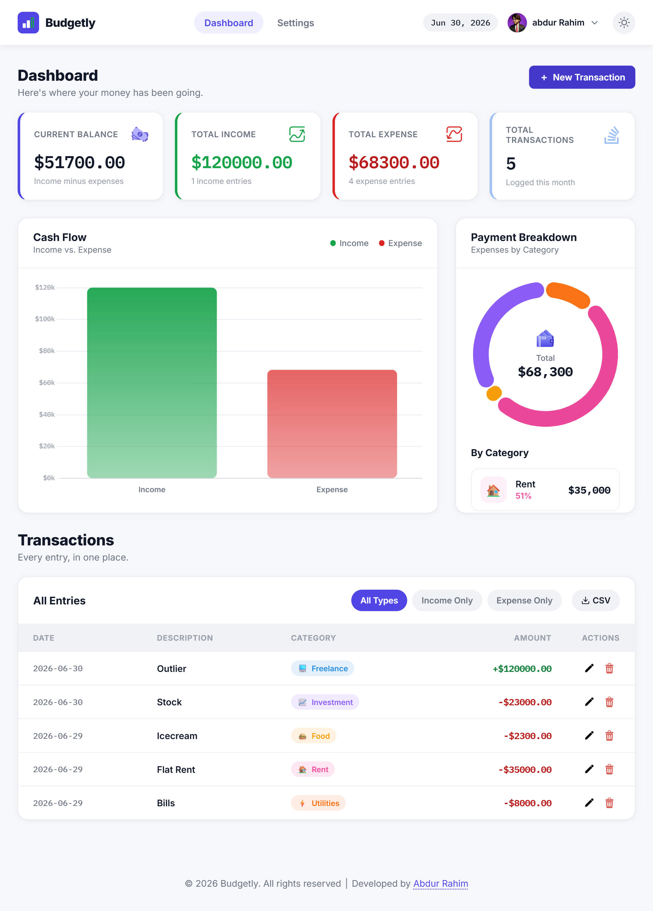
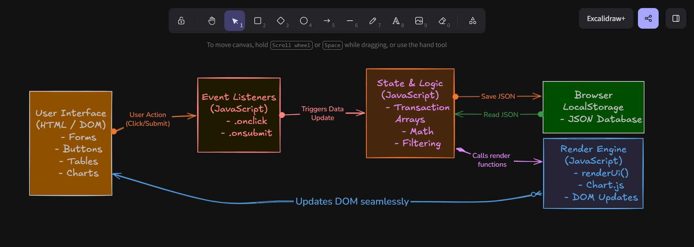
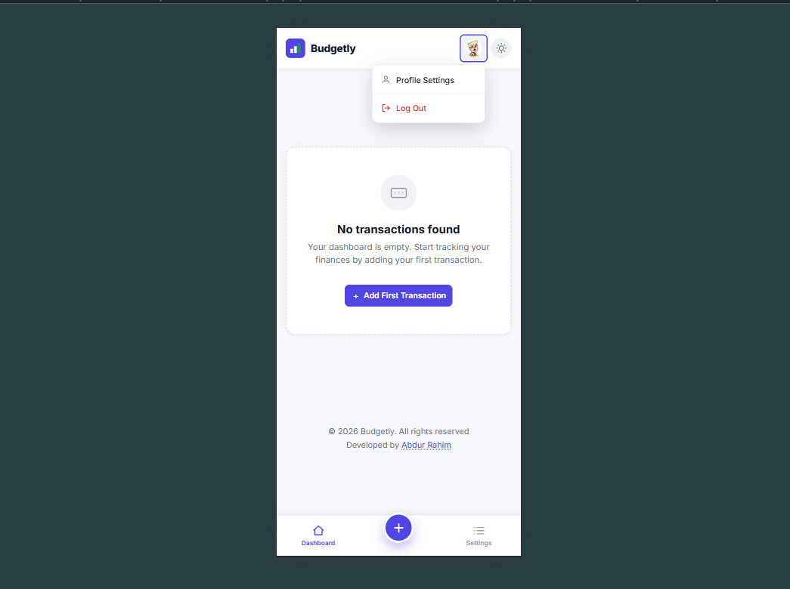

# 📊 Budgetly - Vanilla JS Single-Page Finance Tracker

Budgetly is a robust, fully mobile-responsive Personal Finance Tracker built entirely as a **Single-Page Application (SPA)** using pure Vanilla JavaScript and DOM manipulation. No frontend frameworks, no backend server—just deep, optimized browser APIs and `localStorage`.

## 🏗️ Why a Single-Page Application (SPA)?
The primary architectural goal of this project was to master **core JavaScript state management and DOM manipulation**. By avoiding frameworks like React or Vue, this project demonstrates a deep understanding of:
* **Event Delegation:** Managing click and submit events across dynamically generated HTML elements.
* **Virtual Routing:** Navigating between the Dashboard and Settings pages by manipulating CSS classes (hiding/showing sections) rather than reloading the browser, ensuring a lightning-fast user experience.
* **State Synchronization:** Keeping the UI (charts, tables, stats) perfectly in sync with the underlying JavaScript arrays and `localStorage` database.

---

## ✨ Features

### 📋 Core Requirements (Rubric Achieved)
* **Single-Page Architecture:** Entire application runs from a single `index.html` file without page reloads.
* **Authentication:** Full Login, Register, and Logout flows tied to specific user sessions.
* **Financial Dashboard:** Real-time calculation of Current Balance, Total Income, Total Expense, and Transaction Count.
* **CRUD Operations:** Seamlessly Add, Edit, and Delete transactions via a unified modal interface.
* **Profile Settings:** Users can update their display name and preferred currency (dynamically updates across the whole app).
* **Cash Flow Analytics:** A dynamic Bar Chart comparing Income vs. Expense using `Chart.js`.
* **Personalized Header:** Displays the active username/profile at the top right.
* **Theme Engine:** Native Dark/Light mode toggle that dynamically updates UI and Chart grid lines.
* **Smart Filtering:** Instantly filter the transaction table by "All Types", "Income Only", or "Expense Only".

### 🚀 Premium Enhancements (Beyond the Basics)
* **Payment Breakdown (Pie Chart):** A highly customized doughnut chart visualizing expenses grouped by category, accompanied by a sorted breakdown list.
* **CSV Data Export:** A "Download CSV" tool that safely sanitizes commas and converts local transaction arrays into a downloadable `.csv` file via JS `Blob` objects.
* **Avatar Management:** Users can select from 5 premium preset avatars or upload a custom local image (converted to Base64 with a strict 1MB limit).
* **Dynamic Empty States:** Minimalist, beautifully designed empty state screens that replace charts/tables when a user has no data or no matching filter results.
* **Responsive Design:** Fully fluid CSS Grid/Flexbox layout that degrades gracefully from desktop down to a native-feeling mobile bottom-navigation app.
* **Danger Zone:** A secure "Reset All Data" feature nested in the settings page to safely wipe the database.

---

## 🧠 Key Learnings & Debugging
Building this app without a framework exposed me to several advanced JavaScript concepts and common pitfalls:

1. **Event Listener Leaks ("Ghost Bugs"):**
   * *Issue:* Re-initializing the dashboard caused multiple `.addEventListener` blocks to attach to the same form, resulting in duplicate or `NaN` data entries.
   * *Fix:* Refactored to use `.onsubmit` and `.onclick` properties, ensuring only one listener is ever active, preventing memory leaks and corrupted state.
2. **Chart.js Canvas Conflicts:**
   * *Issue:* Re-rendering the dashboard threw `Canvas is already in use` errors because the old chart was trapped in memory.
   * *Fix:* Implemented `Chart.getChart("id")` to safely locate and `.destroy()` existing chart instances before drawing new ones.
3. **Stale Modal State:**
   * *Issue:* Opening the "Edit" modal, closing it without saving, and opening "Add" caused the app to overwrite the old transaction instead of creating a new one.
   * *Fix:* Implemented defensive programming in a global `closeModal()` function that strictly resets all temporary ID trackers and form inputs every time the modal closes.
4. **CSV Escaping & Blob Generation:**
   * *Issue:* Users typing commas in their descriptions (e.g., "Food, drinks") would break the CSV column layout.
   * *Fix:* Wrapped user input in quotes and escaped existing quotes (`replace(/"/g, '""')`) before dynamically generating a downloadable `Blob` URL.

---

## 🛠️ Tech Stack
* **HTML5:** Semantic layout and accessible form inputs.
* **CSS3:** Custom CSS variables (CSS Properties), CSS Grid, Flexbox, media queries for mobile responsiveness, and custom scrollbars.
* **Vanilla JavaScript (ES6+):** Arrow functions, array methods (`.map`, `.filter`, `.reduce`, `.some`), object mapping, math absolute rounding, and Date formatting.
* **Local Storage API:** Client-side database for persisting registered users and transaction history.
* **Chart.js (CDN):** Data visualization for Bar and Doughnut charts.
